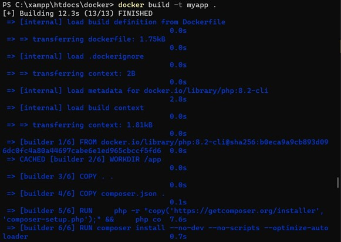
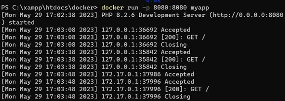
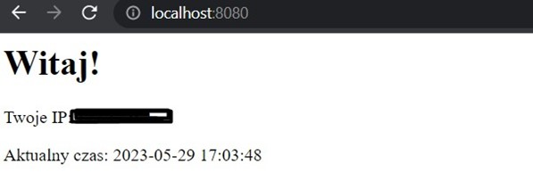
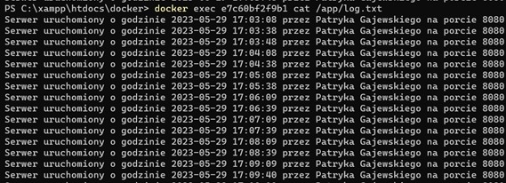
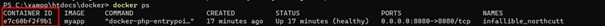
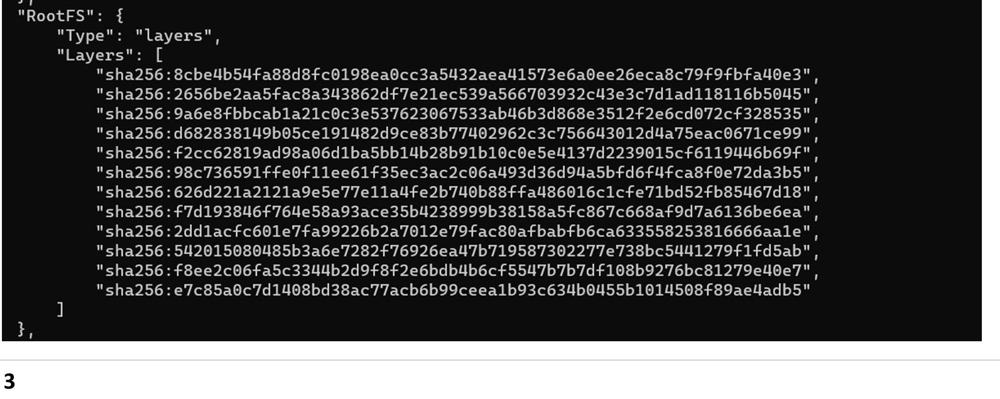

## Punkt 1. 
*docker build -t <nazwa-obrazu> . *
 
 
 
## Punkt 2. 
*docker run -p 8080:8080 <nazwa-obrazu> (należy pamiętać, żeby podać tę samą nazwę obrazu, którą nadaliśmy w poprzednim kroku) *
 
 
 
*Natępnie wpisujemy w przeglądarkę adres http://localhost:8080/ w celu wyświetlenia stworzonego pliku index.php *
 
 
 
## Punkt 3. 
*docker exec <id_kontenera> cat /app/log.txt *
 
 
 
*Id kontenera możemy sprawdzić wpisując w konsolę polecenie docker ps *
 
 
 
## Punkt 4. 
*docker image inspect <nazwa_obrazu>. *
 
 
 
*Zbudowany obraz posiada 12 warstw.*
